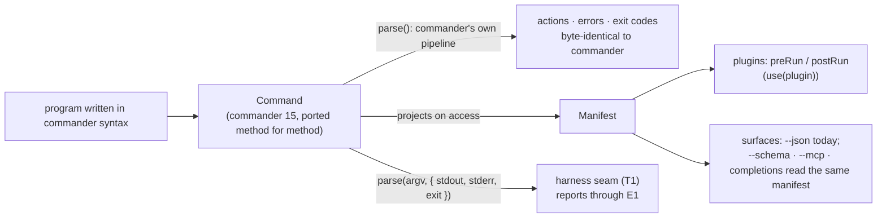

# Design — `commander-compat`

Intent: [`intent.md`](./intent.md). **Status:** review.

---

## Requirements

| id | Requirement |
| :-- | :-- |
| X1 | `burgee/commander` exposes commander 15's public surface: `Command`, `Option`, `Argument`, `Help`, `CommanderError`, `InvalidArgumentError` (+ deprecated alias), `program`, `createCommand`, `createOption`, `createArgument` — and what the suite reaches through the host's internals (`useColor`, `DualOptions`, `humanReadableArgName`) |
| X2 | The vendored commander suite runs against it through `compat-oracle`'s shim, unedited: 1,362 public tests (1 skips itself off Windows) plus 12 internals |
| X3 | The pass rate is published per release and ratchets (C5) |
| X4 | Every divergence is a failing upstream test with a recorded reason; none may be excluded (compat-oracle R3) |
| X5 | `import 'burgee'` pulls zero bytes of this front-end (K6, `weight.test.ts` entry `.`) |
| X6 | The front-end's reachable bytes stay under commander's own `lib/` (126,365 B): budget **128,000** in `weight.test.ts` entry `./commander` |
| X7 | `examples/demo-cli-commander` produces byte-identical output on real commander and on this front-end |
| X8 | A program in commander syntax gains burgee's plugins and surfaces without a line changing (J2, J7, J8), and **nothing about its default behaviour changes** |

## Design

**The parse path is commander's, not the engine's.** The first slice of this front-end
translated calls into `execute()`; the oracle killed that in one run (17 / 1,331). The
suite asserts commander's exact error strings (`error: unknown option '--x'`), its
`EventEmitter` events (`option:foo`, `optionEnv:foo`, `command:*`), thirteen of its
package-level fields (`_name`, `_exitCallback`, `_getHelpOption` …), and an option
grammar — `-abc` groups, `--no-` pairs sharing a value, optional values, variadics,
`passThroughOptions`, negative numbers — that `node:util.parseArgs` cannot express. So
`Command` is a port of `lib/command.js`, `Option`, `Argument`, `Help`, `suggestSimilar`
and the errors, in TypeScript, over no dependency. Fidelity is the requirement; the port
is the design.

**burgee sits beside it, never in front of it.** Four additions, each guarded so a
program that does not ask for them behaves exactly as on commander:

| Addition | Guard |
| :-- | :-- |
| `command.manifest` — the tree projected as `CommandNode`s (null-prototype option records; polluting names rejected) | A getter; projecting changes no state the parse reads |
| `command.use(plugin)` — `preRun`/`postRun` fire around the action, `enforce` order (Vite convention) | Only when a plugin is registered; hooks make the run a promise, so `parseAsync` |
| `--json` — the action's return value in the `{ ok, data }` envelope | Only when no command in the chain declares `--json` itself; taken at the leaf, never at a level that dispatches, so a subcommand's own `--json` is untouched |
| `parse(argv, { stdout, stderr, exit })` — inject the streams and the exit | Only when one of the three is passed; then every `CommanderError` is reported through E1 and the run settles to one exit |

E1 mapping in the injected mode: `commander.helpDisplayed`, `commander.version` → OK;
`commander.help` → OK or USAGE(2) when `{ error: true }`; the usage family (unknown
option/command, missing/excess arguments, missing mandatory, conflicting, invalid
argument) → USAGE(2); `commander.error` and executable-subcommand exits keep their code;
an action throwing → RUNTIME(1). Without injection commander's own codes are emitted,
because a migrating user's scripts depend on them.

**Order of work, driven by the oracle.** The suite is the backlog and its pass rate the
progress bar; each commit reports the rate in its message, so `git log` is the burn-down.

## Verification

`npm run compat` — the loop, exiting non-zero below baseline. `npm run compat -- --control`
proves the gate against real commander in the same run.

Proven-red, per rule 4: the first commit registered the front-end and recorded 17 / 1,307.
Today: **1,361 / 1,361 (100%)** — every test that runs on this OS, the same as the real
commander scores in the same run; the 1,362nd skips itself off Windows and is reported,
not counted. The "4 left" this record carried for a day were never divergences: three
`.cjs` test files `require('../')` — the repo root as a package — and the vendored root
had no `main`, so they failed to import for real commander and for burgee alike and
registered as one test each. The vendor step now writes a root package whose `main` is
the generated shim; the suite's true size is 1,362, not 1,331. CI's OS × Node matrix
re-checks all of it.

The 12 internals tests (`useColor`) pass because the barrel exports `useColor`; they stay
informational.

X7 is wired: `demo-cli-commander` builds its program once (`program.ts`) and exposes it on
real commander (`.`) and on this front-end (`./burgee`); `examples/conformance` runs the
front-end as a fourth host through the same driver and `commander-parity.test.ts` requires
identical `{ code, stdout, stderr }` on 29 argv cases — happy paths, every error class,
help at every level, version, `--`. The demo declares its own `--json`, so it prints the raw
record on both hosts: the guard on burgee's envelope, proven.

## Rejected alternatives

- **Translating calls onto the engine's parser.** Measured: 17 / 1,331. The tests are the
  spec and they assert commander's pipeline.
- **A shared "quirks" module for both hosts.** commander's and yargs' grammars differ in
  exactly the details the suites assert; sharing would couple two specifications. Revisit
  with measurements once `burgee/yargs` exists.
- **A separate npm package.** Subpath exports version with the engine, so a user cannot
  install a front-end that disagrees with the manifest it projects into.
- **Writing our own compatibility tests.** They would encode our reading of commander,
  which is the thing under test.
- **Runtime compatibility mode.** Ships both front-ends to every user (§6 of the map).

## Out of scope

- commander's file layout. Files that import only `../lib/*` are graded on the oracle's
  informational internals line, never the gate.
- The `burgee/yargs` front-end: its own intent.
