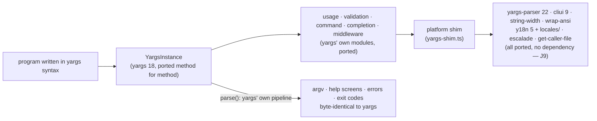

# Design — `yargs-compat`

Intent: [`intent.md`](./intent.md). **Status:** review.

---

## Requirements

| id | Requirement |
| :-- | :-- |
| X1 | `burgee/yargs` exposes yargs 18's public surface: the default-export factory `(processArgs, cwd, parentRequire)` returning the 108-method instance, `YargsInstance`, `getInternalMethods()` in yargs' shape — and what the suite reaches through the host's internals (`YError`, `parseCommand`, `argsert`, `objFilter`, `isPromise`); `burgee/yargs/helpers` exposes `hideBin`, `applyExtends`, `Parser`; `burgee/yargs/parser` is what `import parser from 'yargs-parser'` gave |
| X2 | The vendored yargs suite runs against it through `compat-oracle`'s shim, unedited: 804 public tests plus 23 internals, pinned to yargs 18.1.0 |
| X3 | The pass rate is published per release and ratchets (C5) |
| X4 | Every divergence is a failing upstream test with a recorded reason; none may be excluded (compat-oracle R3) |
| X5 | `import 'burgee'` pulls zero bytes of this front-end (K6, `weight.test.ts` entry `.`) |
| X6 | The front-end's reachable bytes stay under what yargs installs for the same surface (`lib/` 158 K + yargs-parser 52 K + cliui, y18n and the rest): budget **256,000** in `weight.test.ts` entry `./yargs`; `./yargs/helpers` **64,000** and it must never reach the factory |
| X7 | `examples/demo-cli-yargs` produces byte-identical output on real yargs and on this front-end |
| X8 | A program in yargs syntax runs unchanged (J2), and **nothing about its default behaviour changes**; the 29 locales ship with burgee so `.locale()` and `LC_ALL` work as on yargs |

## Design

**The parse path is yargs', not the engine's.** The commander front-end settled this
question once (17 / 1,331 when calls were translated onto the engine; see
`commander-compat`), and yargs' suite is even less forgiving: 4,985 lines of `usage.mjs`
compare whole help screens through cliui's column arithmetic, `command.mjs` asserts the
builder/handler pipeline's freeze–reset–unfreeze bookkeeping through `getInternalMethods()`,
`validation.mjs` asserts every message through y18n, and `completion.mjs` asserts the
zsh-versus-bash output of `--get-yargs-completions`. So the front-end is a port of yargs
18's `build/lib/*` — `yargs-factory`, `usage`, `validation`, `command`, `completion`,
`middleware`, `argsert`, `parse-command`, `apply-extends`, `levenshtein`,
`maybe-async-result` — in TypeScript, one file per upstream module
(`packages/burgee/src/yargs-*.ts`), over no dependency.

**The dependencies are ported too, because burgee depends on nothing (J9).** yargs is
`yargs-parser` + `cliui` (+ `string-width`, `wrap-ansi`, `strip-ansi`) + `y18n` +
`escalade` + `get-caller-file`, reached through one platform-shim object. burgee's
`yargs-shim.ts` is that object, built from `yargs-parser.ts` (the whole of yargs-parser
22: tokeniser, the 18 configuration switches, aliases, nargs, arrays, counts, dot-notation,
env, config files, coercion), `yargs-cliui.ts` (cliui's layout DSL, and the string-width
and wrap-ansi it wraps text with — the arithmetic is the upstream's line for line, because
the usage tests compare screens), `yargs-y18n.ts` (the string table, reading
`locales/<lang>.json` on first use, never writing) and two functions for escalade and
get-caller-file. The 29 locale files ship with the package under `locales/`; they are
data read at runtime, not imports, so the weight lock does not walk them.

**What is *not* yet on this front-end.** The commander front-end's four additions —
`manifest`, `use()`, `--json`, `parse(argv, { stdout, stderr, exit })` — are the next
slice, guarded the same way; this slice is parity only, so the ratchet starts from a
score that means something.

**Order of work, driven by the oracle.** The suite is the backlog and its pass rate the
progress bar; each commit reports the rate in its message, so `git log` is the burn-down.

## Verification

`npm run compat` — the loop, exiting non-zero below baseline. `npm run compat -- --control`
proves the gate against real yargs in the same run.

Proven-red, per rule 4: the oracle graded `burgee/yargs` at an honest 0 / 804 from the day
the suite was vendored ("target not built yet") and the baseline recorded it. First
measured score: 782 / 804, one short of real yargs in the same run. Today:
**804 / 804 (100%)**. The 22 in between were the harness, not the port, and each fix was
proven red in the oracle's own tests first: the vendored root had no `main`, so the CJS
fixture binaries' `require('../../')` could not load (the integration file, 16 tests);
its `package.json` lacked the upstream's `license` and `repository`, which
`.config('foo')` and `.pkgConf('repository')` read from disk (5 tests); the workspace had
installed `which@5` — promise-only — beside the oracle against its `^2.0.2`, so the
suite's callback never fired (2 tests); and `test/parser.mjs` asserts `Parser` is the
object `yargs-parser` exports, so `yargs-parser` is now a public specifier of the host,
rewritten to `burgee/yargs/parser` for burgee and left as itself for the control — a
program that imported the parser directly migrates the same way. The real yargs scores
802 in the same run: its two `--version` fixture cases look the nearest `package.json`
up from inside `node_modules`, which is the oracle's, not the fixture's.

The 23 internals tests (`argsert`, `is-promise`, `obj-filter`, `parse-command`) pass
because the barrel exports those names; they stay informational.

**CodeQL.** The port carries twelve of yargs' own patterns that CodeQL warns on: the
`parse-command` regexes and `applyExtends`' `/\.json|\..*rc$/` (polynomial ReDoS on a
string that is the developer's own command definition or a config path from disk, never
end-user argv), the zsh completion escaping `replace(/:/g, '\\:')` (a format `_describe`
requires, which `completion.mjs` asserts byte for byte — not a sanitiser), and
`delete config.extends` on a config object loaded from disk (`mergeDeep` skips
`__proto__`, as upstream does). Rewriting any of them would move parsing in the edge
cases the suite pins, so each alert is dismissed as *won't fix* with this record as its
comment; the scanner stays on for the files, so anything new still surfaces.

X7 is wired: `demo-cli-yargs` builds its program through a factory, `runYargs` in the
oracle's drivers takes the yargs implementation as a parameter, `examples/conformance`
runs the front-end as a fifth host and `yargs-parity.test.ts` requires identical
`{ code, stdout, stderr }` on 26 argv cases — happy paths, every error class, help at
every level, version, `--`.

## Rejected alternatives

- **Translating calls onto the engine's parser.** Measured for commander: 17 / 1,331. The
  tests are the spec and they assert yargs' pipeline.
- **A shared "quirks" module for both hosts** (the first draft of this design). commander's
  and yargs' grammars differ in exactly the details the suites assert — `-abc` groups,
  `--no-` pairs, negative numbers, dot-notation, greedy arrays — so sharing would couple
  two specifications. Both ports stand alone; each is under its own weight budget.
- **Depending on `yargs-parser` for the identity test.** It would have bought 1 / 804 at
  the price of J9, the property every other lock protects; exposing the ported parser as
  `burgee/yargs/parser` bought it for nothing.
- **A separate npm package.** Subpath exports version with the engine, so a user cannot
  install a front-end that disagrees with the parser it wraps.
- **Writing our own compatibility tests.** They would encode our reading of yargs, which is
  the thing under test.
- **Runtime compatibility mode.** Ships both front-ends to every user (§6 of the map).

## Out of scope

- yargs' file layout. Files that import only `../build/lib/*` are graded on the oracle's
  informational internals line, never the gate.
- Deno and the browser build (`yargs/browser`): yargs ships them as separate entries with
  their own shims; burgee's runtime matrix is Node, bun and deno through `runtime-smoke.yml`.
