<p align="center">
  <a href="https://www.npmjs.com/package/burgee" target="blank">
    <picture>
      <source media="(prefers-color-scheme: dark)" srcset="./brand-assets/burgee-lockup.svg" />
      
    </picture>
  </a>
</p>

<p align="center">
  Everything a CLI needs that isn't your CLI. Written once, served to humans and agents alike.
</p>

<p align="center">
  <a href="https://www.npmjs.com/package/burgee"></a>
  <a href="https://www.npmjs.com/package/burgee"></a>
  <a href="https://github.com/ofri-peretz/burgee/actions/workflows/quality.yml"></a>
  <a href="https://github.com/ofri-peretz/burgee/actions/workflows/codeql.yml"></a>
  <a href="https://app.codecov.io/gh/ofri-peretz/burgee"></a>
  <a href="https://scorecard.dev/viewer/?uri=github.com/ofri-peretz/burgee"></a>
  <a href="./packages/burgee/package.json"></a>
  <a href="https://nodejs.org/"></a>
  <a href="https://www.typescriptlang.org/"></a>
  <a href="LICENSE"></a>
  <a href="https://github.com/ofri-peretz/burgee"></a>
</p>

<p align="center">
  A <strong>CLI framework that replaces commander and yargs</strong>, is drop-in compatible with both, and
  serves every command through every format a caller wants — help, JSON, schema, MCP, completions —
  from one declaration.
</p>

<p align="center">
  <strong>Built for the CLIs agents drive.</strong> A command declares itself once and an agent
  can read that declaration directly: a stable envelope, a versioned schema, an MCP server, and
  an exit code that says <em>rewrite the command</em> rather than <em>something went wrong</em>.
  Nine packages, one repository, one supply chain to audit — and no dependency outside the burgee
  family in any of them. Six take nothing at all; the other three take only each other.
</p>

<p align="center">
  <strong>⭐ <a href="https://github.com/ofri-peretz/burgee">Star the repo</a></strong> &nbsp;·&nbsp;
  <a href="https://github.com/ofri-peretz/burgee/subscription">👀 Watch releases</a> &nbsp;·&nbsp;
  <a href="https://github.com/ofri-peretz/burgee/issues">🐛 Report a bug</a>
</p>

<p align="center">
  <strong>📖 Docs: <a href="https://burgee.interlace.tools">burgee.interlace.tools</a></strong>
  &nbsp;·&nbsp; <a href="https://burgee.interlace.tools/llms.txt">llms.txt</a>
</p>

<p align="center">
  <a href="#-start-here">Start here</a> &nbsp;·&nbsp;
  <a href="#-already-on-commander-change-one-import">Migrate</a> &nbsp;·&nbsp;
  <a href="#-measured">Measured</a> &nbsp;·&nbsp;
  <a href="#-the-family">The family</a> &nbsp;·&nbsp;
  <a href="#-status">Status</a> &nbsp;·&nbsp;
  <a href="#-repo-map">Repo map</a> &nbsp;·&nbsp;
  <a href="./.sdlc/research/">Research</a>
</p>

---

## 👋 Start here

```bash
npm install burgee
```

```js
// cli.mjs — the whole CLI. No build step, no config, no scaffold.
import { defineCommand, run } from 'burgee';

run(defineCommand({
  name: 'greet',
  description: 'Greet someone by name',
  options: { name: { type: 'string', required: true, description: 'who to greet' } },
  effects: 'read_only', // what running it does to the world; required, and what --mcp reads
  run: ({ options }) => ({ greeting: `hello, ${options.name}` }),
}));
```

```console
$ node cli.mjs --name ada
greeting: hello, ada

$ node cli.mjs --name ada --json
{"ok":true,"data":{"greeting":"hello, ada"},"meta":{"provenance":{"name":{"source":"flag","location":"--name"}}}}

$ node cli.mjs                                    # exit 2, not 1
error: missing required option --name
hint: pass --name <value>
```

That is the whole thing: one file, one declaration, and a CLI that already speaks to a person,
to a script and to an agent.

> A **burgee** is the small swallowtail flag a boat flies to say which club it belongs to — a
> flag of identity, not of instruction. That is what a command does here: declares itself
> once, and every surface is that declaration read by a different reader.

---

## 🎏 One declaration, every surface

```text
defineCommand()  ──▶  manifest  ──┬──▶  human help
                                  ├──▶  --json      one stable envelope
                                  ├──▶  --schema    versioned, one document per surface
                                  ├──▶  --mcp       an MCP server, generated
                                  ├──▶  completions bash · zsh · fish · pwsh
                                  ├──▶  TypeScript types
                                  └──▶  docs + llms.txt
```

Surfaces cannot drift, because there is nothing to keep in sync. Adding the next one is an
emitter, not a feature.

---

## 🤖 What an agent sees

The same command, asked for its own definition. No wrapper, no sidecar file, no scraping
`--help`:

```console
$ node cli.mjs --schema     # trimmed; arguments and examples also come back
{
  "options": {
    "name": { "type": "string", "required": true, "description": "who to greet" }
  },
  "inputSchema": { "type": "object", "properties": { "name": { "type": "string" } } }
}

$ node cli.mjs --mcp        # the same command, served as an MCP server over stdio
```

Six issues across nine years of the commander and yargs trackers ask for machine-readable
command structure, and the state of the art today is a regex over `--help`
([tracker-gap-analysis.md](./.sdlc/research/tracker-gap-analysis.md)). A manifest is not a
feature bolted on for agents — it is the thing help was rendered from in the first place.

What that is worth needs no model to measure. Ten tasks per variant, one spawn each,
non-TTY with **stdin closed** — the only environment an agent gets — running the same demo
program on each engine:

| Variant | hangs / 100 | exit code correct | `--json` answered |
| :--- | ---: | ---: | ---: |
| **burgee** | 0 | **100.0%** | **100.0%** |
| commander | 0 | 40.0% | 25.0% |
| yargs | 0 | 40.0% | 25.0% |

Exit code is the one that decides an agent's next move: `2` means *rewrite the command*, any
other non-zero means *the command was fine and the world was not*. This measures legibility,
not tokens — the token and turn halves of B1 are still [unmeasured](#-measured), and are
labelled as such rather than estimated.

---

## 🔌 Extend every layer

Every package in the family takes plugins, and all nine take them the same way. A plugin is a
plain object. Each package validates it against **one published schema** — the same
`schema.json` ships in every package — and each has a `check` command that shows what a plugin
contributes, or refuses it with a code and the fix, before it ships.

Each package reads its own key and ignores the rest, so **one object can extend every layer at
once**: brand colours, a spinner, a terminal quirk, a config source, where the company's tools
live, what to flush on exit, a prompt of its own, and a command every one of its CLIs gets.

<!-- plugins:start -->

| Package | A plugin adds | Check it |
| :--- | :--- | :--- |
| [`bellpull`](./packages/bellpull/) | `resolvers` | `npx bellpull check ./plugin.mjs` |
| [`burgee`](./packages/burgee/) | `commands`, `hooks` | `npx burgee check ./plugin.mjs` |
| [`caique`](./packages/caique/) | `widgets` | `npx caique check ./plugin.mjs` |
| [`closeout`](./packages/closeout/) | `handlers` | `npx closeout check ./plugin.mjs` |
| [`flagstaff`](./packages/flagstaff/) | `tokens`, `glyphs`, `spinners`, `borders`, `components` | `npx flagstaff check ./plugin.mjs` |
| [`linegauge`](./packages/linegauge/) | `widths` | `npx linegauge check ./plugin.mjs` |
| [`paratext`](./packages/paratext/) | `capabilities` | `npx paratext check ./plugin.mjs` |
| [`roundel`](./packages/roundel/) | `tokens` | `npx roundel check ./plugin.mjs` |
| [`seniority`](./packages/seniority/) | `sources` | `npx seniority check ./plugin.mjs` |

<!-- plugins:end -->

Where an incumbent has an extension point — commander's `.hook()`, yargs middleware,
cosmiconfig's loaders, inquirer's `createPrompt` — it lives in one program or one call. A
plugin here is written once and shared: across programs, across layers, and across commander,
yargs and native syntax alike. The [plugins page](./apps/docs/content/docs/plugins.mdx) has the
whole nine-layer example, which every package's `check` accepts in CI, each incumbent's own
extension point beside ours, and what a plugin cannot do yet.

---

## 🔁 Already on commander? Change one import

```diff
- import { Command } from 'commander';
+ import { Command } from 'burgee/commander';
```

Or `npx burgee migrate`, which makes that change — and the same one for chalk, ora,
string-width, cross-spawn, signal-exit and every other incumbent the family replaces at full
grade — then prints the install command to run next
([Migrate](./apps/docs/content/docs/migrate.mdx)).

Your code and your tests are unchanged. Compatibility is not asserted here, it is graded —
each host's own suite, vendored unmodified apart from the import specifier, pointed at
burgee and run in CI against a control that runs the real host:

| Host | Front-end | burgee | rate |
| :-- | :-- | ---: | ---: |
| commander | `burgee/commander` | 1360 / 1360 | **100%** |
| yargs | `burgee/yargs` | 804 / 804 | **100%** |

Measured 2026-09-09; five more hosts — chalk, ora, log-update, boxen, cli-table3 — are in
the [full table](./apps/docs/content/docs/compatibility.mdx), generated by
`npm run compat:page` and never hand-edited. Rates are measured against the control's total
rather than against registered tests, because a file that fails to import registers as one
test instead of its twenty and would flatter a partial implementation.

And you immediately gain something commander cannot sell you at any price: **plugins**. Its
plugin RFC ([#2505](https://github.com/tj/commander.js/issues/2505)) has been open and
unanswered for years; yargs offers middleware on one program, not a plugin shared across
programs.

A plugin contributes to the manifest, and the manifest never records which façade filled
it — so one plugin works on commander syntax, yargs syntax and native alike.

---

## 🧭 A better commander, not another oclif

oclif has every capability on this page and does **10.9M downloads a week against
commander's 508M**. The difference is not features, it is shape. So the shape is locked
first, ahead of every other requirement, and `Z1` is a **test**: it installs the published
tarball into a temp directory, writes exactly one file, and runs it. The day that needs a
second file, a config or a build step, CI goes red.

Everything beyond that first rung — precomputed manifests, plugins, the dev loop, scaffolding
— is additive and removable.

---

## 📏 Measured

2026-09-09, Apple M4 Pro, darwin/arm64, Node 24, 42 interleaved spawns per variant. † is a
published figure taken on another machine, not reproduced here.

| | **burgee** | commander | yargs | @oclif/core | cac |
| :--- | ---: | ---: | ---: | ---: | ---: |
| Runtime dependencies | **5**, none outside the burgee family | 0 | 6 | **18** | 0 |
| Full CLI run over bare node | **+14.0 ms** | +15.3 ms | +78.5 ms | +131 ms † | +4.0 ms |
| Installed size | 1304 KB | 203 KB | 515 KB | 912 KB † | 40 KB |

The speed comes from `node:util.parseArgs` being in the standard library, not from a faster
language: burgee is TypeScript, like both incumbents.

Milliseconds are a property of the machine that produced them, so nothing gates on them.
What is gated is the ratio between two spawns interleaved in the same run, which cancels the
machine out. Nine of those gates are stated in public — **five are met, three are not, and one
has never been measured**:

| Claim | Gate | Measured | |
| :--- | :--- | ---: | :--- |
| the core entry point is under 52 KB bundled | `core-under-52kb-bundled` | 24,202 bytes | ✅ met |
| `burgee/yargs` is lighter in a user's bundle than `yargs` | `lighter-than-yargs` | 0.961× | ✅ met |
| `burgee` is lighter than `cac` **plus what a cac user installs to match it** | `lighter-than-cac-at-parity` | 0.248× | ✅ met |
| `burgee/commander` is lighter than `commander` **plus the same** | `lighter-than-commander-at-parity` | 0.483× | ✅ met |
| `burgee/yargs` is lighter than `yargs` **plus the same** | `lighter-than-yargs-at-parity` | 0.539× | ✅ met |
| `burgee` starts at or below `cac`, the lightest framework in the landscape | `cold-start-at-or-below-cac` | 1.443× | ❌ **not met** |
| `burgee/commander` is lighter in a user's bundle than `commander` alone | `lighter-than-commander` | 1.561× | ❌ **not met** |
| `burgee` is lighter in a user's bundle than `cac` alone | `lighter-than-cac` | 2.316× | ❌ **not met** |
| an agent spends ≥40% fewer tokens and ≥30% fewer turns | `agent-tokens-40pct` | — | **unmeasured** |

### The two ways to ask the bundle question, and why both are here

`burgee` is 24,202 bundled bytes and `cac` is 10,452, so the bare row reads **2.316× and it
stays on this page**. It is also not the choice anyone makes. A program that picks `cac` and
then wants its config file read, its shutdown bounded on every path out, and its cursor handed
back on Ctrl-C installs three more packages — and *that* is what one `import` of burgee competes
with:

| | the incumbent alone | + what you add to match burgee | ours |
| :--- | ---: | ---: | ---: |
| `cac` | 10,452 B | **97,711 B** | 24,202 B |
| `commander` | 39,084 B | **126,354 B** | 61,014 B |
| `yargs` | 111,152 B | **198,269 B** | 106,868 B |

The additions are `cosmiconfig` (find and load a config file), `exit-hook` (run cleanup on
every path out, including a signal) and `restore-cursor` (hand the terminal back), bundled
together so a module two of them share is paid for once — which is what a real bundler does.

**The rule that stops this being a rigged denominator:** a package may only enter a stack where
this repository publishes a *graded drop-in* for it — a `compat-oracle` row whose pass rate
comes from that package's own test suite. `seniority/cosmiconfig`, `closeout/exit-hook` and
`closeout/restore-cursor` each have one, which is evidence we do the job rather than our word
for it, and [`parity.test.ts`](./benchmarks/parity.test.ts) fails if an addition names a package
with no active row. It is self-limiting on purpose: we cannot pad a stack with packages we
merely resemble.

And the capabilities with nothing to add against — `--schema`, `--mcp`, the `{ ok, data }`
envelope on every command, agent detection, option relations and Standard Schema — are priced
at **zero**. They are the part of the premium that is real and unpriced, and saying so is worth
more than finding a package to charge for them.

### The three that are not met

`cold-start-at-or-below-cac` and the two bare weight rows have a measured floor above their own
gate, and it is worth saying plainly rather than leaving as a to-do. `cac` is 10,452 bytes of
parser and help renderer; burgee's 24,202 is that plus coercion, choices, relations, Standard
Schema, configuration precedence, signal-bound shutdown, terminal restore and agent detection.
Our `commander/command.js` is 33,487 bundled against commander's 27,226, and the front-end also
carries a cross-platform spawn that cannot go lazy without giving up `parse()`'s synchronous
contract and the 1360 / 1360 compat row that rests on it. And `import 'cac'` is one file in
4.2 ms where `import 'burgee'` is twenty-one in 20 ms. Closing them means deleting the product,
not optimising it; the decision is [D-102](./.sdlc/DECISIONS.md).

The last one has never run. B1 spawns 50 agent runs and refuses to start without a credential,
and nothing in the suite can turn a run that did not happen into a number — `emit.test.ts`
enforces that. It is [D-103](./.sdlc/DECISIONS.md).

Installed size is our largest number and it is larger than commander's. It buys no dependency
outside the burgee family and six drop-in front ends, and it stays on the page either way: *not met* and
*unmeasured* are different outcomes and neither collapses into the other. Every bundle figure
in this section, including the ones that go against us, is written by `npm run readme:gates`
from a fresh bundle of the build, and a push whose build measures anything else is refused
([`readme-gates-lock.test.ts`](./scripts/readme-gates-lock.test.ts)). The millisecond and
installed-size figures come from the measurement published in
[`benchmarks.mdx`](./apps/docs/content/docs/benchmarks.mdx) and pinned in
[`comparison.mdx`](./apps/docs/content/docs/comparison.mdx).

---

## 👥 Who is this for?

| You are… | What burgee gives you |
| :--- | :--- |
| **Shipping your first CLI** | One file, no dependency outside the burgee family, help and `--json` for free |
| **Maintaining a commander CLI** | A one-line import swap, graded against commander's own suite |
| **Building for agents** | `--schema`, `--mcp` and a stable envelope, projected — never hand-written |
| **On a platform team** | Plugins that work across commander, yargs and native syntax alike |

---

## 🧩 The family

<p align="center">
  
  
  
  
  <br />
  
  
  
  
  
</p>

<p align="center">
  <sub>One family, cut from one ink, with the Interlace mark on every one of them and one
  light crossing all nine. Only burgee flies the swallowtail: a roundel is rings, a
  flagstaff is a flag hoisted on a pole, a caique is a parrot, a line gauge is the printer's
  rule with its ticks cut through it, seniority is rank chevrons, a bellpull is the cord and
  its pull, a closeout is the double rule an accountant draws under a settled total, and a
  paratext is a page with its text cut away — only the margins are left. The
  light sweeps where a page can afford motion and parks itself under prefers-reduced-motion;
  the favicon and the npm READMEs take the still one. Every mark is burgee/brand output —
  nine shapes, one declaration — regenerated by npm run brand and drift-checked in CI.</sub>
</p>

**burgee** declares; the **output stack** is what a CLI shows; the **foundation** is what it
stands on. Every one is an independent product with its own README and its own incumbents, and
none has a dependency outside the burgee family.

A complete CLI on the incumbents is a dozen packages under a handful of accounts. This is
nine packages, one repository, one release pipeline and one supply chain to audit, with a
single schema byte-identical in every tarball. That is the argument for one codebase here:
not convenience, but the number of things a user has to trust — and the dependency bill is
the number, 0 against the dozen.

| | Layer | Package | What the layer owns | Replaces | Status |
| :-- | :-- | :-- | :-- | :-- | :-- |
| **Engine** | argv, dispatch, manifest | [`burgee`](./packages/burgee/) | one declaration projected to help, `--json`, `--schema`, MCP, completions, types | commander · yargs | released — `burgee@0.13.0` |
| **Output stack** | colour | [`roundel`](./packages/roundel/) | one output policy, nine semantic tokens, a contrast-checked theme, and chalk's API over them | chalk · picocolors | released — `roundel@0.5.2` |
| | render | [`flagstaff`](./packages/flagstaff/) | frame loop with a static projection; plugin host for spinners, progress, boxes, tables | ora · log-update · boxen · cli-table3 | released — `flagstaff@0.4.2` |
| | prompt | [`caique`](./packages/caique/) | prompts that are flags first, and never hang | inquirer · clack · prompts | released — `caique@0.5.2` |
| **Foundation** | text | [`linegauge`](./packages/linegauge/) | measure, wrap, truncate and slice styled text without the edge fraying | string-width · wrap-ansi · strip-ansi · slice-ansi | released — `linegauge@0.5.3` |
| | config | [`seniority`](./packages/seniority/) | precedence across flag, env, project file, home file and default — with provenance | cosmiconfig · dotenv · rc | released — `seniority@0.6.1` |
| | process | [`bellpull`](./packages/bellpull/) | run a subprocess; resolve the executable; return a result every caller can read | execa · cross-spawn · which | released — `bellpull@0.4.1` |
| | lifecycle | [`closeout`](./packages/closeout/) | exit handlers that run once on every path, terminal restore, bounded deadline | signal-exit · exit-hook · restore-cursor | released — `closeout@0.5.2` |
| | terminal | [`paratext`](./packages/paratext/) | hyperlinks, images, window title, clipboard, notifications, bell — each with a static fallback | ansi-escapes (OSC half) · terminal-link · term-img | released — `paratext@0.7.1` |

All nine are released on npm. Where an incumbent's own test suite has been vendored, the
compat oracle grades the drop-in path against it and publishes the rate — including the ones
not yet at 100% — on the [compatibility page](https://burgee.interlace.tools/docs/compatibility).
Released is not the same as accepted: the four
foundation packages began as `0.0.1` name reservations, were built out in waves F1–F4, and
their intents under [`.sdlc/intents/cli-foundation-stack/`](./.sdlc/intents/cli-foundation-stack/)
are still at `draft` — the human gate on the design has not run, and all nine are pre-1.0, so
an API can still move. The `bellpull` intent carries a kill gate, because a zero-dependency
rival already holds the weight pitch in that layer, and its spec says plainly that the package
was built before that gate was evaluated. The measurements behind the layers are in
[`candidate-layers.md`](./.sdlc/research/candidate-layers.md) and
[`replacement-map.md`](./.sdlc/research/replacement-map.md).

---

## 📚 Repo map

| Path | Purpose |
| :-- | :-- |
| [`packages/burgee/`](./packages/burgee/) | The framework. `burgee` is the engine, `burgee/commander` the compat façade, `burgee/testing` the in-process harness (T1). |
| [`packages/roundel/`](./packages/roundel/) | **roundel** — the colours a CLI carries: `roundel/policy` (`outputMode`, `colorLevel`), `roundel/tokens` (nine semantic tokens), `roundel/theme` (`fly()`, contrast-checked), `roundel/contrast`, and `roundel/chalk` — chalk 6's API over the tokens, graded by chalk's own suite (58 / 58, against a 58 / 58 control). Intent in [`.sdlc/intents/roundel/`](./.sdlc/intents/roundel/). |
| [`packages/flagstaff/`](./packages/flagstaff/) | **flagstaff** — the staff the flag flies from: a frame loop with a static projection for agents, and the plugin host for spinners, progress, boxes and tables. Released; its one dependency is roundel. Intent in [`.sdlc/intents/flagstaff/`](./.sdlc/intents/flagstaff/). |
| [`packages/caique/`](./packages/caique/) | **caique** — the parrot that always answers back: prompts that are flags first and never hang. Released, with graded `caique/inquirer` and `caique/clack` paths; intent in [`.sdlc/intents/caique/`](./.sdlc/intents/caique/). |
| [`packages/linegauge/`](./packages/linegauge/) | **linegauge** — a printer's rule for text: width, wrap, truncate and slice, grapheme-correct over `Intl.Segmenter`. Released; intent in [`.sdlc/intents/linegauge/`](./.sdlc/intents/linegauge/). |
| [`packages/seniority/`](./packages/seniority/) | **seniority** — which source outranks which, with provenance for every resolved value. Released; intent in [`.sdlc/intents/seniority/`](./.sdlc/intents/seniority/). |
| [`packages/bellpull/`](./packages/bellpull/) | **bellpull** — pull here, work happens there: subprocesses with a structured result and a static projection. Released; intent in [`.sdlc/intents/bellpull/`](./.sdlc/intents/bellpull/). |
| [`packages/closeout/`](./packages/closeout/) | **closeout** — settle and finish: exit handlers that run once, terminal restore, and a deadline so shutdown cannot hang. Released; intent in [`.sdlc/intents/closeout/`](./.sdlc/intents/closeout/). |
| [`packages/paratext/`](./packages/paratext/) | **paratext** — everything around the output that is not the output: hyperlinks, images, window title, clipboard, notifications and the bell, each with a static fallback. Released; intent in [`.sdlc/intents/paratext/`](./.sdlc/intents/paratext/). |
| [`packages/compat-oracle/`](./packages/compat-oracle/) | Internal, never published. Grades compatibility using the hosts' own suites, plus reference drivers that run the real incumbents for byte-for-byte comparison. |
| [`examples/`](./examples/) | Demo CLIs and the conformance suite that runs every floor case on every host. |
| [`apps/docs/`](./apps/docs/) | The front-door documentation site (Next.js + fumadocs), deployed at [burgee.interlace.tools](https://burgee.interlace.tools) with [`llms.txt`](https://burgee.interlace.tools/llms.txt) and a Markdown twin of every page. Every other package has its own site at `https://<package>.interlace.tools` — `apps/docs-<package>/`, on the shared chassis `apps/docs-chassis/` — named once in [`.github/vercel-apps.json`](./.github/vercel-apps.json). |
| [`.sdlc/intents/`](./.sdlc/intents/) | Stage 1 + 2 artifacts of the AI-native SDLC: `intent.md` + `spec.md` per change, and the wave plan. |
| [`.sdlc/research/`](./.sdlc/research/) | The evidence everything above rests on. |
| [`.sdlc/brand/`](./.sdlc/brand/) | What each package is and what its mark has to say ([identity model](./.sdlc/brand/identity-model.md)), and the [brief](./.sdlc/brand/commission.md) a designer would work from. |

### The research

Every claim in the design traces to one of these, and each records what it could **not**
determine as well as what it found.

- [`competitor-landscape.md`](./.sdlc/research/competitor-landscape.md) — the measured map:
  downloads, cold start, the compatibility bill, and why we implement rather than wrap.
- [`tracker-gap-analysis.md`](./.sdlc/research/tracker-gap-analysis.md) — every open item in
  both trackers. Commander has 8; yargs has 211, 86% predating 2023. Six issues over nine
  years ask for machine-readable command structure, and the state of the art is
  regex-scraping `--help`.
- [`agent-requirements.md`](./.sdlc/research/agent-requirements.md) — what agents need, and
  **three widely-quoted claims that do not survive verification**.
- [`cli-market-requirements.md`](./.sdlc/research/cli-market-requirements.md) — ten production
  CLIs taken apart, including what the security market requires and where both leading
  scanners get it wrong.
- [`architecture.md`](./.sdlc/research/architecture.md) — the diagrams.
- [`lineage.md`](./.sdlc/research/lineage.md) — the six projects we follow, each reduced to a
  commitment.

---

## 🚦 Status

| | What |
| :-- | :-- |
| ✅ **Working today** | The engine, the exit-code contract, the JSON envelope, help from the manifest, plugins with hook filters, and a `burgee/commander` façade that runs a real commander program |
| 🔨 **Next** | The compatibility oracle, and the remaining commander surface |
| ⛔ **Not yet true** | The dev loop, prompts, lazy commands and groups, and an adopter we did not write ourselves |

Four locks — shape, process-reference, weight per entry point, and the adoption ladder — are
each proven to fail before they passed. A compat façade does not reach 1.0 until its host's
own suite passes **100%** (`C7`): both do today, which clears that gate and not the rest —
1.0 waits on the [floor](./apps/docs/content/docs/the-floor.mdx), 114 requirements of which
the surfaces, the env/config/schema families and both façades are built. Until then the rate
is published rather than the word "compatible" claimed.

---

## 🛠️ Working on burgee

```bash
npm install
npm test           # every lock and unit test, exits non-zero on failure
npm run dev        # docs on http://localhost:3100
npm run compat     # grade burgee against commander's and yargs' own suites
npm run brand      # regenerate every brand surface from one declaration
npm run brand:check # …and fail if any of them was hand-edited since
```

### Dogfooding

This repo runs 12 Interlace ESLint plugins with **every rule on at `error`** and zero
warnings allowed:

| Scope | Plugins |
| :-- | :-- |
| Everywhere | `secure-coding` · `node-security` · `conventions` · `import-next` · `maintainability` · `modernization` · `modularity` · `operability` · `reliability` |
| The docs app | `react-a11y` · `react-features` · `browser-security` |

The rule list is computed from each plugin's own table, so a rule shipped in a plugin release
is on here the day it lands — `browser-security` alone brings 41. Every exception is named in
`eslint.config.mjs` with its reason.

The three scoped to `apps/` are scoped for a reason: the engine never runs in a browser, so
storage, `postMessage` and DOM-sink rules have nothing to say about it — but the docs app is
a real browser application, and that is exactly the surface they grade.

It earns its keep. During this project those rules caught a prototype-pollution vector in
our own option parsing, a barrel import that cost ~5ms of startup, and a façade reaching for
`process` behind the runtime seam.

---

## 🤝 Contributing

The most useful thing anyone can send is **an adopter we did not write**: a real CLI ported
over, and a report of what broke. That is the only compatibility evidence that counts, and
every failure becomes a case in the conformance suite.

[CONTRIBUTING.md](./CONTRIBUTING.md) has the loop, how a change is shaped before it is
written, and what the checks will hold you to. [SECURITY.md](./SECURITY.md) is the private
reporting path — please do not open a public issue for a vulnerability.

- **Ported a CLI?** [Tell us what broke](https://github.com/ofri-peretz/burgee/issues) — the highest-value report we get
- **Found a bug?** [Open an issue](https://github.com/ofri-peretz/burgee/issues) with the Node version and the exact argv
- **Have an idea?** [Open an issue](https://github.com/ofri-peretz/burgee/issues/new)

---

## 📄 License

MIT © [Ofri Peretz](https://github.com/ofri-peretz) — see [LICENSE](./LICENSE). Every
published package ships the licence text in its tarball.

<p align="center">
  <sub>Flying the flag for CLIs that humans and agents can both read.</sub>
</p>
