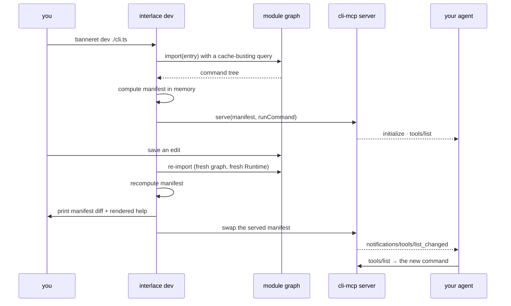

# Design — `dev-loop`

Intent: [`intent.md`](./intent.md). **Status:** review.

---

## Requirements

| id | Requirement |
| :-- | :-- |
| W1 | `banneret dev <entry>` watches the entry's module graph and reloads on change, with a fresh `Runtime` each time |
| W2 | It serves MCP on stdio concurrently, using `cli-mcp`'s server, and emits `tools/list_changed` on every reload |
| W3 | Each reload prints the manifest and the rendered help, so one save shows every surface |
| W4 | It is dev-time only and fully removable (Z2); a project that never runs it is byte-identical |
| W5 | No directory convention: it watches the entry file it is given (Z1) |
| W6 | Save-to-agent-callable is under 500ms on the 30-command demo |

## Design

Reload is `import()` with a cache-busting query parameter on the entry, which discards the
module graph without a custom loader. Node's own `fs.watch` provides the trigger, so the
dev command adds no dependency (K1, constraint 3).

**Why the manifest makes this nearly free.** The manifest is already computed in memory at
startup by default (Z5), and every surface is a projection of it (`architecture.md` §1). A
reload is therefore: re-import, recompute, swap the reference, notify. There is no build
step to re-run because there is no build step.

**State isolation (constraint 4).** Each reload constructs a new `Runtime` and a new
command tree; the MCP server holds a reference that is swapped atomically between tool
calls. An in-flight call finishes against the tree it started on.

**Order of work.** Watch-and-reload printing the manifest first — useful on its own and it
proves the reload semantics. Then the MCP server alongside it. Then
`tools/list_changed`. Then the W6 benchmark.

## Verification

`packages/dev/src/reload.test.ts` writes a temp CLI, starts the watcher against a fake
clock and a fake stdio pair, edits the file, and asserts: a new tool appears in
`tools/list`, `tools/list_changed` was emitted, and a call routed to the *new* handler
rather than a cached one.

Proven-red, per rule 4: the stale-handler assertion is written first against an
implementation that caches the module graph, and observed failing.

W4 is a lock: `shape.test.ts` already asserts a one-file CLI works with nothing but the
framework installed; a second case asserts that removing the dev dependency changes no
shipped artifact.

## Rejected alternatives

- **A directory convention (`src/commands/**`) so the watcher knows what to reload.** This
  is the first step toward oclif's shape and Z1 exists to prevent it. Watch the entry.
- **HMR that preserves handler state.** A CLI starts in milliseconds; a full reload is
  correct, simple, and cannot serve a stale closure.
- **A custom Node loader hook.** A cache-busting query does the same job with no loader,
  no flag, and no dependency.
- **HTTP transport for the dev MCP server.** Same reasoning as `cli-mcp`: a server
  lifecycle, auth and a network surface a CLI has no business owning.
- **Making `banneret dev` the documented entry point for new projects.** It is a
  convenience; the documented entry point is one file and `node cli.js` (Z4).

## Out of scope

- Watching and reloading *plugins* from other packages. Rung two of the ladder; the same
  mechanism will extend, but it is not needed to prove the loop.
- A TUI or dashboard. The output is a manifest diff and rendered help, printed.
- Production process management. This is a dev command and says so.
