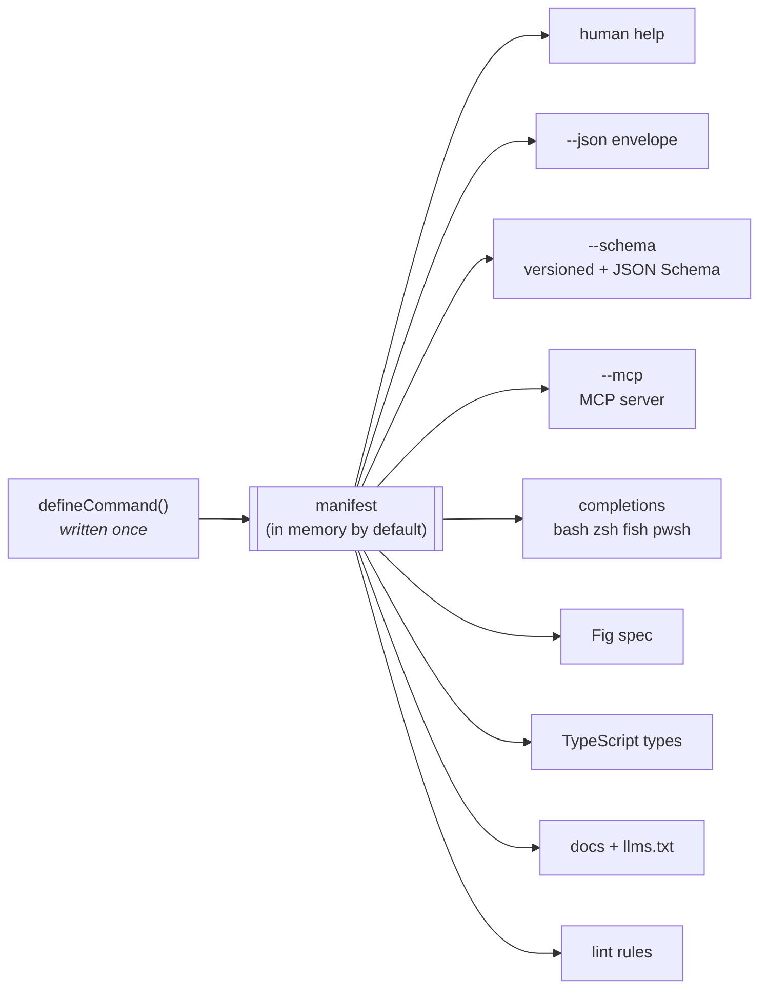
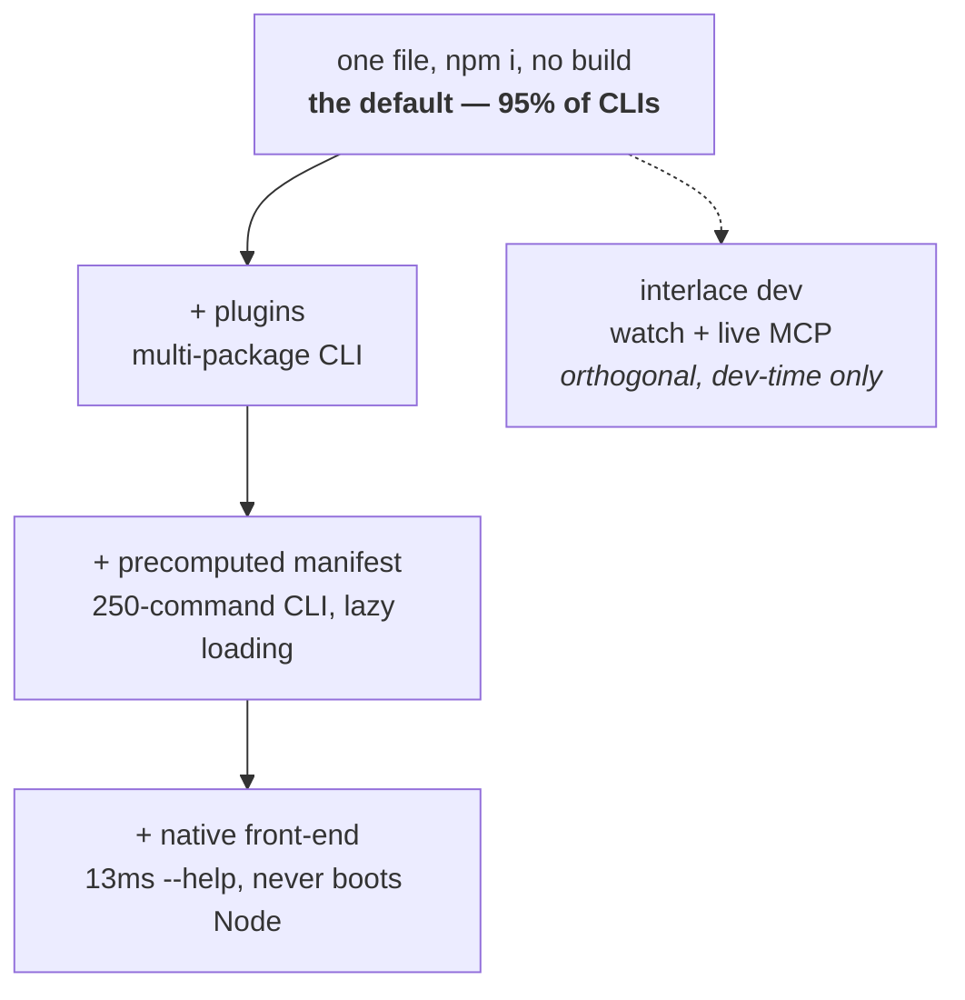
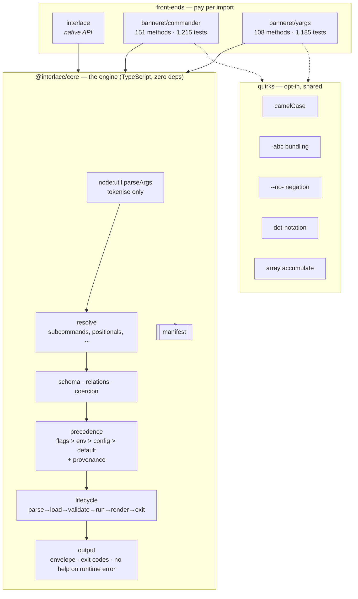
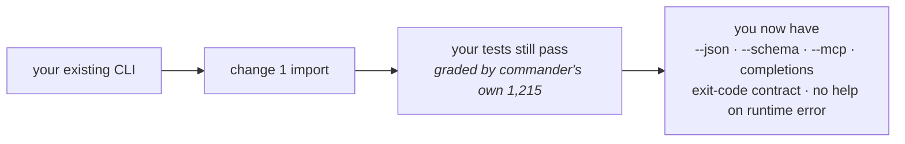
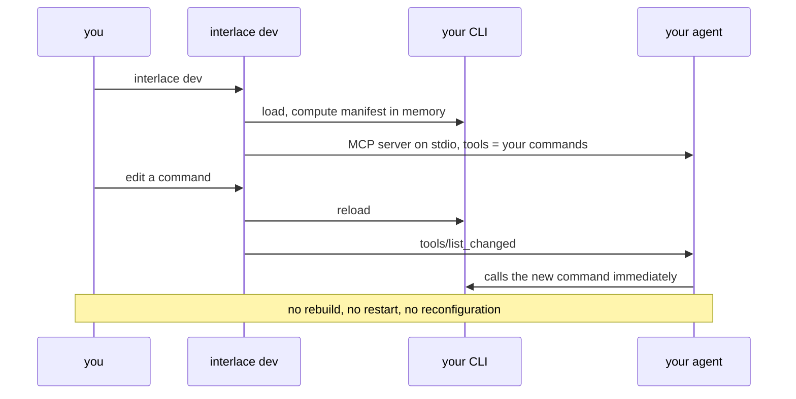
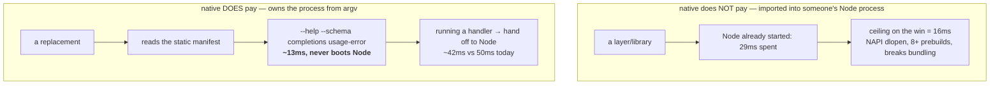
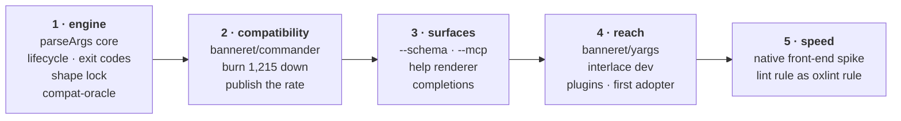
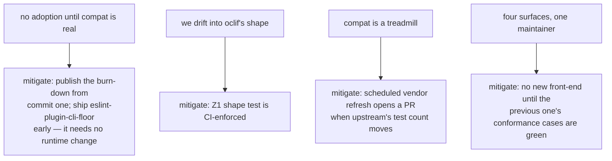

# Architecture

The product in diagrams. Prose only where a diagram cannot carry it.

Decided 2026-09-06: we are building a **CLI framework that replaces commander and
yargs**, is drop-in compatible with both, and serves every command through every format
a caller might want. Not a layer on top of them.

## 1. The thesis: one declaration, every surface



Every surface is a **projection of the same manifest**. They cannot drift, because there
is nothing to keep in sync. Adding a tenth surface is a new emitter, not a new feature.

This is the reason to switch. Compatibility is only the reason it is cheap to try.

## 2. The shape lock: a better commander, not another oclif

oclif has every capability below and does **10.9M/week against commander's 508M**. The
difference is shape, not features: oclif is a framework you scaffold into, commander is a
library you import.

```
         commander                  us                        oclif
         ─────────                  ──                        ─────
day 1    npm i commander            npm i interlace           npx oclif generate
         write 1 file               write 1 file              ~40 files, a build step
         node cli.js                node cli.js               18 runtime deps
                                        │
                                        │  opt in, only if you need it
                                        ▼
                                    banneret manifest   (250-command CLIs)
                                    banneret dev        (watch + live MCP)
                                    plugins              (multi-package CLIs)
                                    interlace init       (scaffold, if you want one)
```

**Z1 is a test, not a principle.** `shape.test.ts` makes a temp directory, installs the
tarball, writes **one file**, runs it, asserts the output. If it ever needs a second file,
a config, or a build step, we have become oclif and CI goes red.

Progressive disclosure, stated as a ladder:



Each rung is additive and removable. Delete any of them and rung one still works.

## 3. Engine and front-ends



The two hosts disagree observably, so one parser cannot be bug-compatible with both.
**Two front-ends over one engine** is the only shape that works — and the quirks they
need are shared modules, not duplicated code.

`import { defineCommand } from 'interlace'` pulls **zero bytes** of either front-end.
Asserted by benchmark axis B4, not by intention.

## 4. Migration: one import line

```diff
- import { Command } from 'commander';
+ import { Command } from 'banneret/commander';
```



The claim is never the word "compatible". It is a **published pass rate**, ratcheting, in
CI on every PR:

```
compat-commander  ████████████████████░░░░  1,050 / 1,215   (86.4%)   ▲ +38 this week
compat-yargs      ██████████░░░░░░░░░░░░░░    480 / 1,185   (40.5%)   ▲ +52 this week
```

That burn-down is also the marketing. A number going up in public is more persuasive than
any announcement, and it is the honest version of "100%".

## 5. The local feedback loop



Your agent is connected to your CLI **while you are writing it**. Change a flag and the
agent sees it on the next call. This is dev-time only and entirely optional — rung one of
the ladder never starts a server.

## 6. Where a faster language pays, and where it does not



| Path | Node + commander today | native front-end |
| :--- | ---: | ---: |
| `--help`, `--schema`, completions, usage error | 50ms | **~13ms** |
| running a handler | 50ms | ~42ms |

Discovery is most of what an agent does before it does anything, so this is ~4× on the
traffic that matters. It is also **structurally impossible for a layer** — a layer is
imported into a process that already booted.

The taxonomy behind the rule:

| Tool | Language | Owns process? | Work per run |
| :--- | :--- | :--- | :--- |
| TypeScript 7 / tsgo | **Go** | yes | thousands of files |
| oxlint | Rust | yes | thousands of files |
| rolldown | Rust | yes (NAPI) | thousands of modules |
| vite | **TypeScript** | yes | *orchestrates the natives* |
| commander / yargs | **TypeScript** | **no — your CLI does** | ~5 argv tokens |

**Go, not Rust**, if we do it: TS7 chose Go because it allowed a near line-by-line port
preserving identical behaviour. Our binding constraint is the same kind — fidelity against
2,304 tests, not raw speed.

Gated on a spike, and the engine stays TypeScript either way. The native front-end is
rung four of the ladder: additive, removable, and it reads the same manifest.

## 7. Build order



Wave 1 ends with something installable. Every wave after it ends with a higher public
compatibility number.

## 8. What could still kill this

Recorded so it is not discovered late.



The honest one is R1. A layer earns users while it is being built; a replacement earns
none until it works. The burn-down is the only thing that makes the wait visible.
